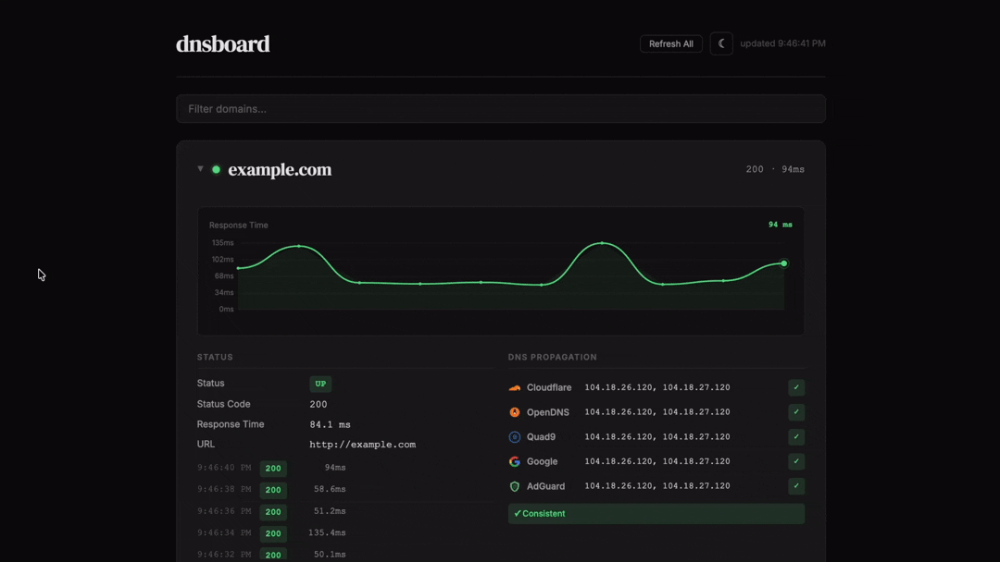

<div align="center">

# dnsboard

**Real-time DNS, SSL, and uptime dashboard for your domains.**

[](https://python.org)
[](LICENSE)
[](https://flask.palletsprojects.com)
[](https://pipx.pypa.io)

Run `dnsboard example.com` and a browser opens with a live monitoring dashboard.



</div>

## Installation

### Recommended: pipx

```bash
pipx install git+https://github.com/august-andersen/dnsboard.git
```

Or from a local clone:

```bash
git clone https://github.com/august-andersen/dnsboard.git && cd dnsboard
pipx install .
```

### Alternative: pip + venv

On macOS, `pip install` is restricted system-wide. Use a virtual environment instead:

```bash
git clone https://github.com/august-andersen/dnsboard.git && cd dnsboard
python3 -m venv .venv
source .venv/bin/activate
pip install .
```

## Usage

```bash
# Monitor specific domains
dnsboard example.com mysite.org

# Run without arguments to use a saved preset
dnsboard

# Options
dnsboard --port 9090 example.com       # Custom port
dnsboard --no-browser example.com      # Don't auto-open browser
dnsboard --list-presets                 # List saved presets
dnsboard --delete-preset my-apps       # Delete a preset
```

On first run with domains, you'll be prompted to save them as a preset for quick access later.

## Features

- **Uptime Monitoring** — live HTTP pings every 2 seconds with response time charts
- **DNS Records** — A, AAAA, MX, NS, TXT, CNAME, SOA
- **DNS Propagation** — checks against Google, Cloudflare, Quad9, OpenDNS, and AdGuard
- **SSL Certificates** — issuer, expiry, days remaining (alerts at <30 days)
- **WHOIS** — registrar, creation/expiry dates (alerts at <60 days)
- **Domain Presets** — save and reload domain lists for quick access

## License

MIT
